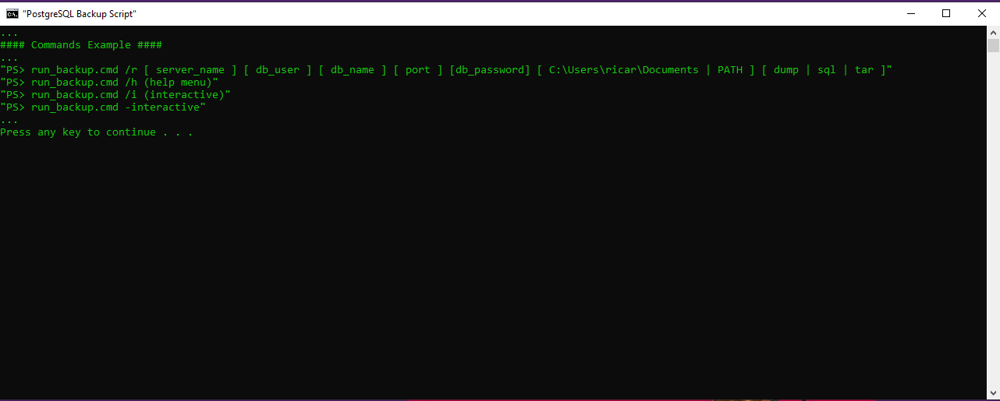
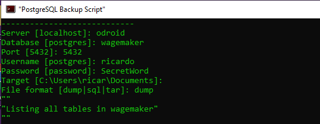

# PSQLBackupBatch

Initial PostgrSQL Backup Windows Batch Scripts for PowerShell and cmd including local binaries also to run backups, scripts are still under development and will include additional all database backups for postgresql and mysql.
 
...
#### Commands Example ####
... 
"PS> run_backup.cmd /r [ server_name ] [ db_user ] [ db_name ] [ port ] [db_password] [ PATH ] [ dump | sql | tar ]"  
"PS> run_backup.cmd /h (help menu)" 
"PS> run_backup.cmd /i (interactive)" 
"PS> run_backup.cmd -interactive" 
... 

 
 
